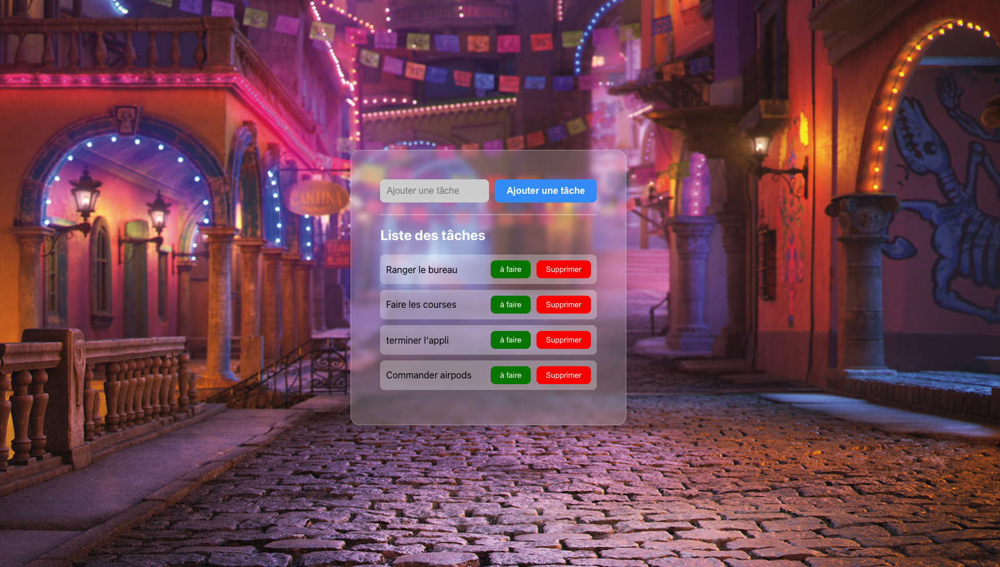

# Mon Projet de Gestion des Tâches
Ce projet est une simple application de gestion des tâches construite avec React. Il permet d'ajouter, de supprimer et de marquer des tâches comme terminées.

]

## Fonctionnalités
- Ajouter une nouvelle tâche
- Supprimer une tâche existante
- Marquer une tâche comme terminée

## Installation
Suivez ces étapes pour installer et lancer le projet sur votre machine locale :

1. Clonez ce dépôt sur votre machine locale en utilisant la commande suivante :
```bash
git clone https://github.com/RomainRamanzin/todo_app_react.git
```

2. Naviguez vers le répertoire du projet :
```bash
cd todo_app_react
```

3. Installez les dépendances du projet :
```bash
npm install
```

4. Lancez le projet :
```bash
npm start
```

L'application devrait maintenant être accessible à l'adresse http://localhost:3000.
